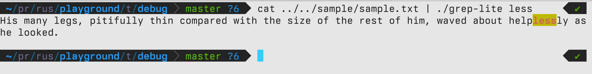

## Building
This project uses [Cargo](https://crates.io). To build, run `cargo build` in the root directory of the project.

## Usage
Once you've built the project you can run the output like this:
```bash
grep-lite <pattern> <file>
```

You can also pipe input into the program:
```bash
cat <file> | grep-lite <pattern>
```

A sample file is included in the root directory of the project. You can run the program on it like this:
```bash
grep-lite "less" sample/sample.txt # or cat sample/sample.txt | grep-lite "less"
```
 And the output should be:
 
 > In this case I'm running the program within the Debug directory, so the path to the sample file is `../sample/sample.txt`


